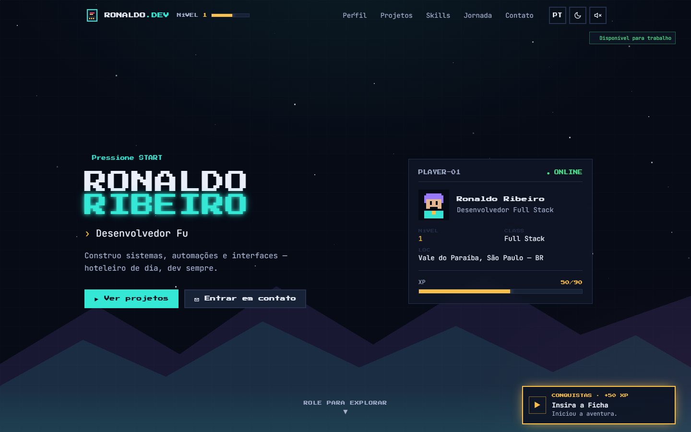
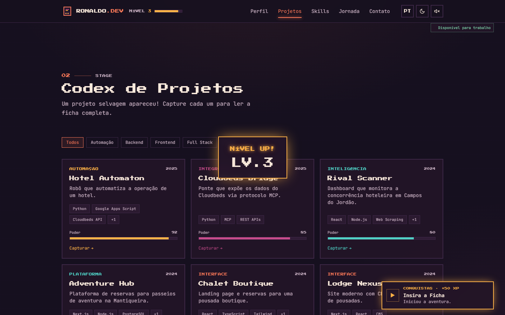
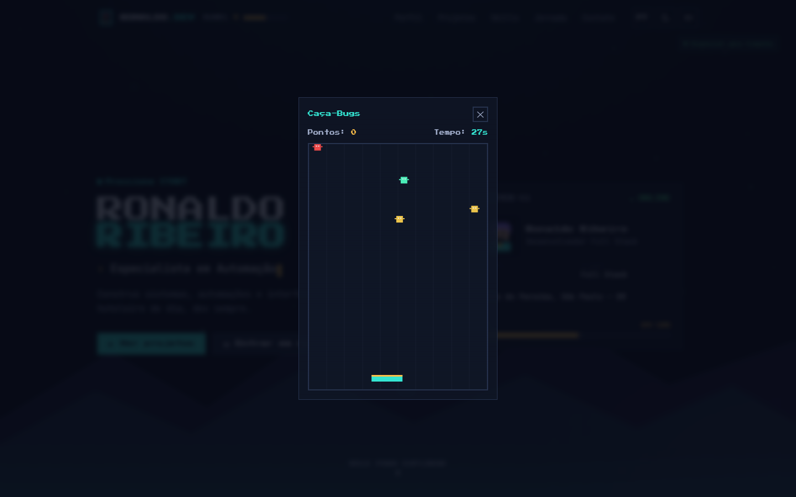
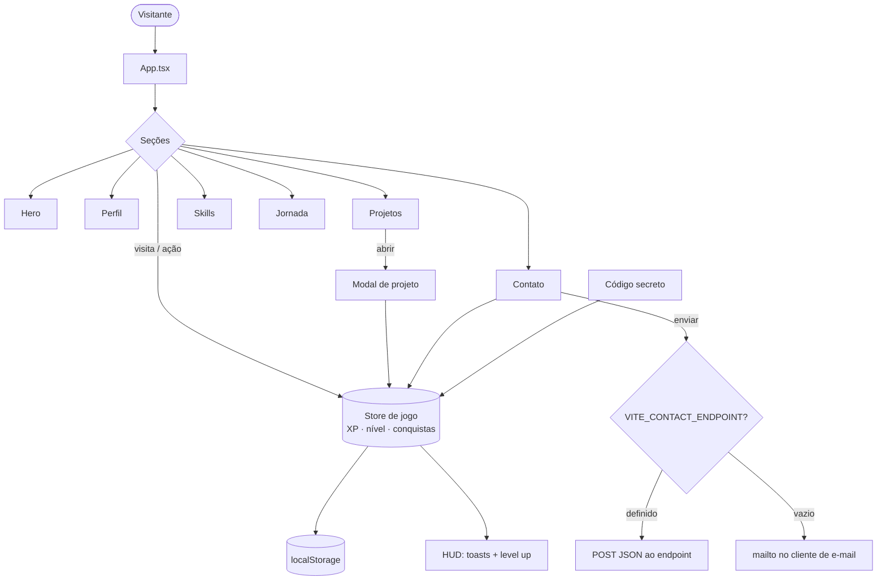

# Ronaldo Ribeiro — Portfolio Arcade

Portfolio pessoal de **Ronaldo Ribeiro**, desenvolvedor full stack, construído como uma
experiência interativa em estética arcade retrô. Em vez de uma página estática, quem entra
"joga" pelo portfolio: ganha XP, sobe de nível e desbloqueia conquistas enquanto conhece os
projetos, as skills e a trajetória — sempre com o conteúdo profissional em primeiro plano.

> Projeto pessoal e privado. Toda a arte e os sons que vêm no repositório são autorais; há um
> sistema de troca para você usar seus próprios sprites/áudios (ver *Assets pessoais*).



## Problema

Portfolios de desenvolvedor tendem a ser todos iguais: uma lista de projetos, uma lista de
tecnologias e um formulário de contato. Recrutadores passam segundos em cada um e raramente
lembram de algum. Para quem trabalha com freelance e precisa se destacar, "mais um site
genérico" não abre portas.

## Solução

Transformar o portfolio em uma pequena aventura. A navegação vira progressão: cada seção
visitada, cada projeto aberto e cada ação dá XP e sobe o nível do "jogador". Conquistas
aparecem como toasts, e um código secreto de arcade libera um modo especial. A gamificação
aumenta o tempo de permanência e torna a visita memorável — sem esconder a informação que
importa (projetos reais, stack real, formas de contato).

Toda a identidade visual é **autoral**: pixel art, tipografia de fliperama e paleta neon
disciplinada, sem usar marcas, personagens, sprites ou sons de terceiros — pronto para
publicar.

## Telas e funcionalidades implementadas

- **Hero** com efeito de digitação, parallax de montanhas/estrelas e um "cartão de jogador" com nível e barra de XP.
- **Perfil** com bio e atributos animados estilo ficha de RPG.
- **Projetos** em grade de cartuchos, com filtros por categoria e modal de detalhes (com foco preso e fechamento por `Esc`).
- **Skills** agrupadas por área, com barras de status que preenchem ao entrar na tela.
- **Jornada** em timeline vertical com checkpoints.
- **Contato** em estilo terminal, com validação inline, honeypot anti-bot e tela de sucesso; envia via Formspree (endpoint configurável) ou `mailto`.
- **Cena de captura**: ao abrir um projeto, uma cápsula é "lançada" com um "CAPTURADO!/GOTCHA!".
- **Mini-game** "Caça-Bugs" jogável (easter egg: 3 cliques no logo) — captura bugs e ganha XP.
- **Gamificação**: XP, níveis, 8 conquistas e aviso de "level up", tudo persistido no navegador.
- **Bilíngue** (PT/EN), **dois temas** (Retro / Cyber) e **som chiptune** sintetizado (desligado por padrão).
- **Easter egg**: o código clássico de arcade (↑ ↑ ↓ ↓ ← → ← → B A) libera o modo lendário.
- **Companheiro pixel** que segue o cursor (só em telas grandes, respeitando `prefers-reduced-motion`).

| Grade de projetos | Mini-game "Caça-Bugs" |
| --- | --- |
|  |  |

## Stack

| Camada | Tecnologia |
| --- | --- |
| UI / Framework | React 18 + TypeScript |
| Build / Dev server | Vite 5 |
| Estilo | Tailwind CSS 3 |
| Animação | Framer Motion 11 |
| Estado + persistência | Zustand 4 (localStorage) |
| Áudio | Web Audio API (chiptune sintetizado, sem arquivos) |
| Fontes | Press Start 2P (títulos) · JetBrains Mono (texto) |

## Como rodar

Requisito: Node.js 18+.

```bash
npm install       # instala dependências
npm run dev       # ambiente de desenvolvimento em http://localhost:5173
npm run build     # build de produção em /dist
npm run preview   # pré-visualiza o build de produção
```

## Estrutura e fluxo



## Personalização

- **Conteúdo e traduções**: tudo em [`src/data/content.ts`](src/data/content.ts) — perfil, projetos, skills, experiência, conquistas e textos de interface (PT/EN). Não é preciso mexer nos componentes.
- **Links pessoais**: objeto `profile.links` no mesmo arquivo.
- **Formulário de contato**: crie um `.env` (veja `.env.example`) e defina `VITE_CONTACT_ENDPOINT` (ex.: [Formspree](https://formspree.io/)) para receber os envios direto; sem isso, o formulário usa `mailto`.
- **Cores e temas**: tokens em [`src/index.css`](src/index.css) (`:root` para Retro, `[data-theme='cyber']` para Cyber).

### Assets pessoais (sprites e sons)

Quer usar seus próprios sprites e efeitos sonoros? Coloque os arquivos em
[`public/assets/`](public/assets/) e aponte os caminhos em
[`src/data/assets.ts`](src/data/assets.ts). Dá para trocar o avatar do jogador, o companheiro
que segue o cursor e cada efeito sonoro. Onde ficar em branco, o site usa a arte e o som
autorais que já vêm no projeto. Detalhes em [`public/assets/README.md`](public/assets/README.md).

## Créditos

- Tipografia: [Press Start 2P](https://fonts.google.com/specimen/Press+Start+2P) e [JetBrains Mono](https://fonts.google.com/specimen/JetBrains+Mono) (Google Fonts, SIL Open Font License).
- Pixel art, sons e demais elementos visuais são autorais.

## Licença

[MIT](LICENSE) © Ronaldo Ribeiro
